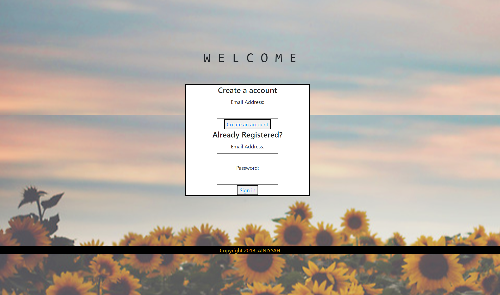
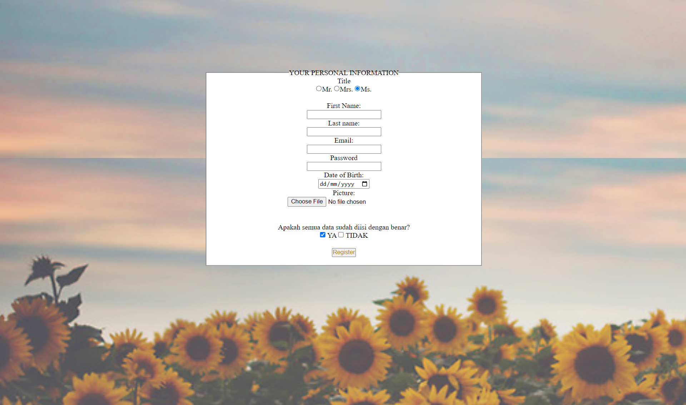
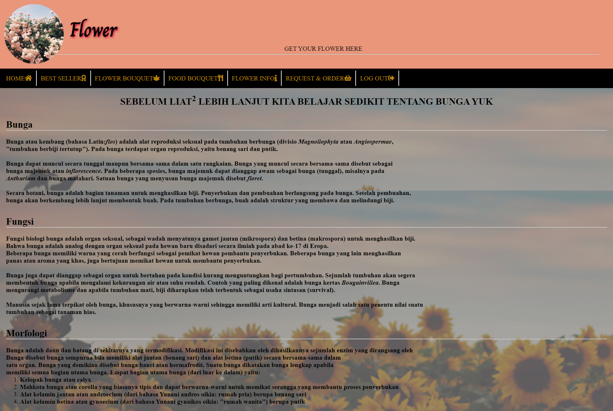
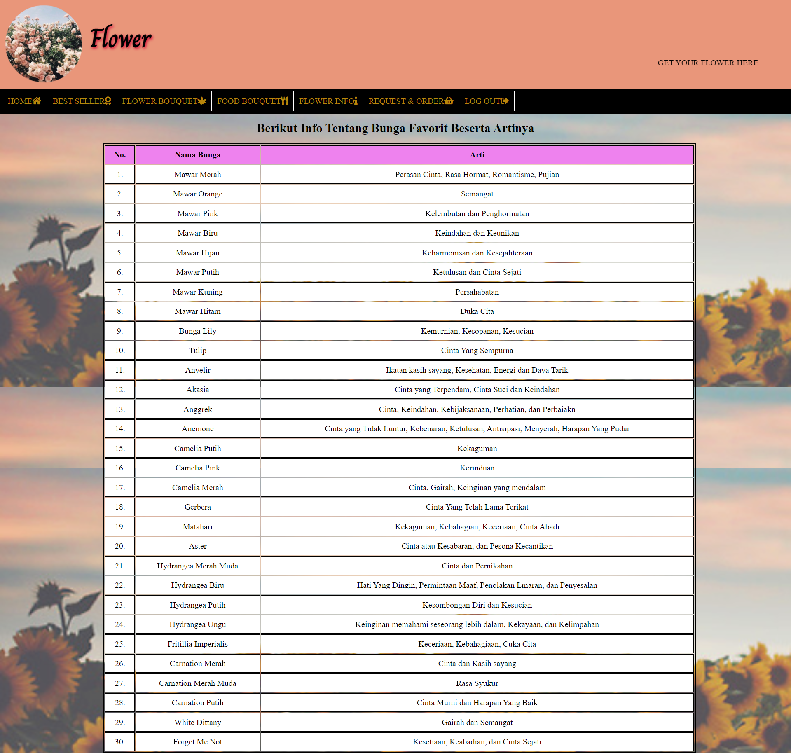
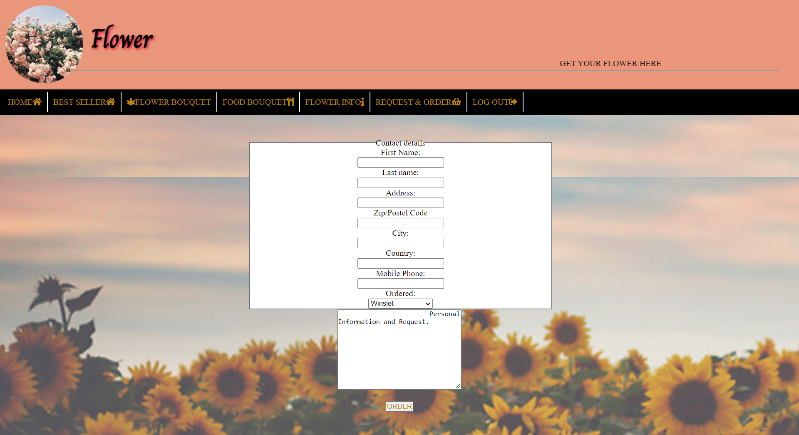
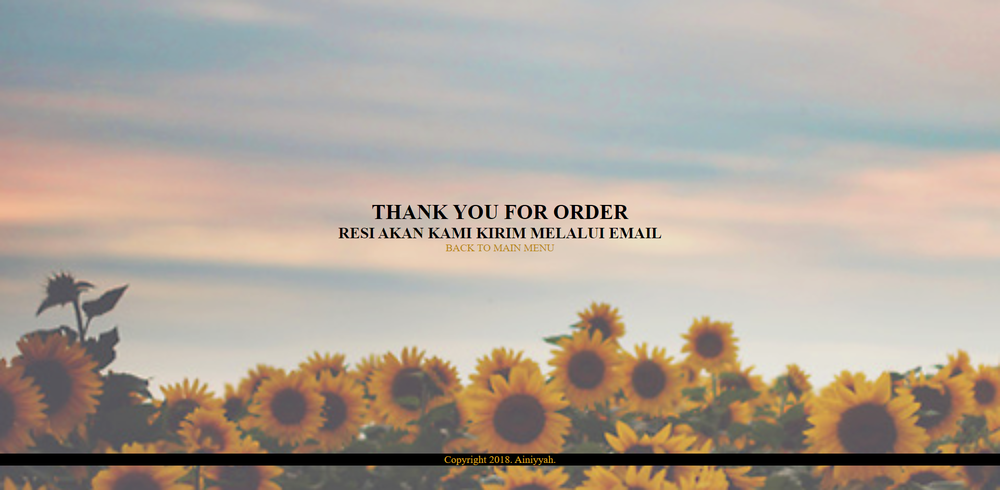

# Web Technology Introduction Course Project
### This project is an assignment from the Introduction to Web Technology course on campus. This project is my first website about a flower shop, created using HTML, CSS and Bootstrap. 

 

# How To Install
### Install all files and open .html file using your browser

 

# ScreenShot

